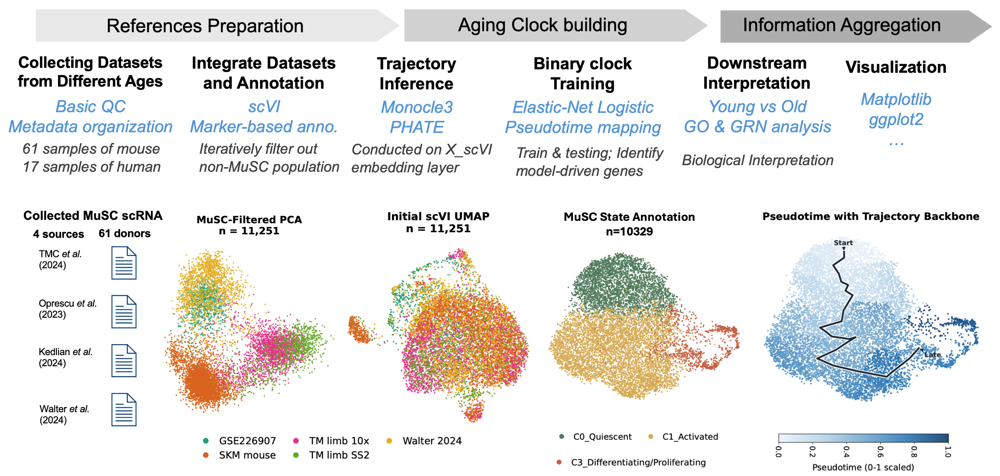
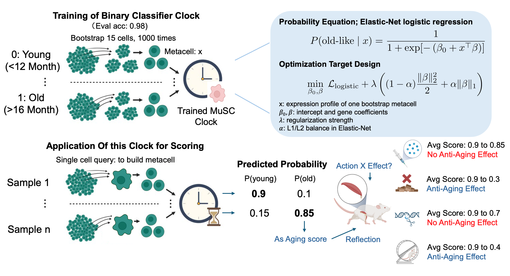

# BS_thesis_workflow

Computational workflow for a bachelor thesis on decoding age-associated transcriptional states in muscle stem cells (MuSCs).
Companion repository to the main thesis document.

## Thesis scope

- Biological focus: distinguish resilient quiescence from age-associated dysfunctional MuSC states.
- Computational focus: atlas harmonization, donor-aware modelling, and interpretable age-state classification.
- Mouse core workflow first; post-injury and human extension modules are documented separately.

## Repository structure

```
env/          Conda environment freeze files (Python + R)
docs/         Workflow notes, script mapping, and method details
scripts/      Analysis entry points and figure-generation scripts
```

## Environment setup

Two conda environments are required:

```bash
# Python analysis environment
conda env create -f env/msc_entropy_py.yml
conda activate msc_entropy_py

# R trajectory environment (Monocle3)
conda env create -f env/msc_entropy_r.yml
conda activate msc_entropy_r
```

The R environment is needed only for `run_monocle3_musc_atlas.R`. All other scripts use the Python environment.

## Reading guide

1. `docs/general_workflow.md` — conceptual pipeline overview with biological and computational logic.
2. `docs/collection_preprocess.md` — mouse atlas assembly and source-data preprocessing.
3. `docs/SCRIPT_OVERVIEW.md` — maps thesis analyses to individual scripts.
4. `docs/method_details_msc_entropy_py.md` — environment setup and core package versions.

## Workflow figures

Main pipeline



Age-state classifier methodology



## Reproducibility note

- This repository is a cleaned thesis workflow bundle, not a full raw-data redistribution.
- Some scripts rely on machine-specific data paths not committed here. Download the source datasets (see Supplementary Table S1) and update paths in the relevant scripts.
